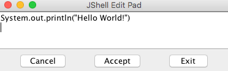
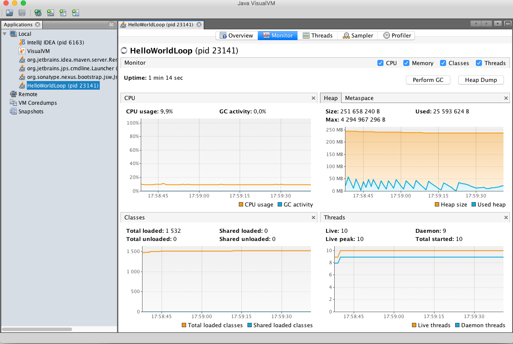

## Executing jshell

`jshell` s a Read-Eval-Print-Loop (REPL) tool that many language toolsets contain and there were also implementations from Java. REPL is a tool that has interactive prompt and language commands that can be directly entered without editing some standalone file. The entered commands are executed directly and then the loop starts again, waiting for the user to type in the next command.

```bash
$ jshell | Welcome to JShell -- Version 11-ea | For an introduction type: /help intro jshell>
```

The `jshell` starts up in an interactive way and the prompt it displays is jshell> to help you recognize that jshell is running.

Let's type next commands
> `/help intro`

> `/help`

> `/list`

Let's start with a small Java snippet, that is, the ageless **Hello World** example:
```java
jshell> System.out.println("Hello, World!")
Hello World!
```

The next thing we should try is declaring a variable, as follows:
```Java
jshell> var a = 13
a ==> 13
```

The type of the variable is int, which is an abbreviation for integer types in Java. Now, we have this variable already in our snippet, so we can print it out if we want to, as shown here:
```java
jshell> System.out.println(a)
13
```
It's time to write something more complex into jshell than a one-liner:
```java
jshell> void main(String[] args){
   ...> System.out.println("Hello, World")
   ...> }
|  Error:
|  ';' expected
|  System.out.println("Hello, World")
|         
```

As jshell is interactive, it is easy to correct the mistake—press the up arrow key a few times to get back the previous lines and, this time, add the semicolon at the end of the second line:
```Java
jshell> void main(String[] args){
   ...> System.out.println("Hello, World");
   ...> }
|  created method main(String[])
```

This method was created for us as a snippet, and now we can call it:
```Java
jshell> main(null)
Hello, World
```

You can list all the snippets that were created using `/list`. As we want to go on writing a full Java version of hello world, we can save our work from jshell to a file, as follows:
```bash
jshell> /save HelloWorld.java
```
Finally, we exit from jshell by typing `/exit`.

To see the content of the file, we use the shell command `cat HelloWorld.java` and the content is
```bash
$ cat HelloWorld.java
System.out.println("Hello, World!")
var a = 13;
System.out.println(a)
void main(String[] args){
System.out.println("Hello, World");
}
main(null)
```

The file contains all the snippets that we typed in, one after the other. If you think that you have messed up the shell with lots of variables and code snippets that you do not need anymore, you can issue the `/reset` command. After this command, the jshell is as clean:
```
jshell> /reset
|  Resetting state.
```

We can also loaded the content of the file by issuing the /open command:
```
jshell> /open HelloWorld.java
Hello, World!
13
Hello, World
```
It loads the line from the file and executes it, just as the characters were typed into the Command Prompt.

You may recall that the `/list` command printed a number in front of each snippet. We can use it to edit the snippets individually. To do so, issue the `/edit` command, followed by the number of the snippet:
```
jshell> /edit 1
```

`jshell` opens a separate graphical editor that contains the snippet to edit, as shown:


Edit the text in the box so that it will look like this:
```Java
void printf(String format, Object... args) { System.out.printf(format, args); }
printf("Hello World!")
```
Click on **Accept** and then **Exit**.

Jshell also defines a few snippets that are automatically loaded when jshell starts or resets. You can see these if you issue the `/list` command with the `-start` option, as follows:
```
jshell> /list -start

  s1 : import java.io.*;
  s2 : import java.math.*;
  s3 : import java.net.*;
  s4 : import java.nio.file.*;
  s5 : import java.util.*;
  s6 : import java.util.concurrent.*;
  s7 : import java.util.function.*;
  s8 : import java.util.prefs.*;
  s9 : import java.util.regex.*;
 s10 : import java.util.stream.*;
```

If you want to list all the snippets you entered as well as the predefined snippets, and also those that contained some error and thus were not executed, you can use the `-all` option on the `/list` command, as follows:
```
jshell> /list -all
  s1 : import java.io.*;
  s2 : import java.math.*;
  s3 : import java.net.*;
  s4 : import java.nio.file.*;
  s5 : import java.util.*;
  s6 : import java.util.concurrent.*;
  s7 : import java.util.function.*;
  s8 : import java.util.prefs.*;
  s9 : import java.util.regex.*;
 s10 : import java.util.stream.*;
   1 : System.out.println("Hello, World!")
   2 : var a = 13;
   3 : System.out.println(a)
   4 : void main(String[] args){
       System.out.println("Hello, World");
       }
   5 : main(null)
   6 : void printf(String format, Object... args) { System.out.printf(format, args); }
   7 : System.out.println("Hello, World!");
```
If you want to execute some of the snippets again, you only have to type `/n`, where `n` is the number of the snippet, as follows:
```
jshell> /1
System.out.println("Hello, World!")
Hello, World!
```

To re-execute the last n-th snippet. You have to write `/-n`. Here, *n* is the number of the snippet counting from the last one. So, if you want to execute the very last snippet, you have to write /-1. If you want to execute the one before the last one, you have to write /-2. Note that if you already typed /-1, the last one is the re-execution of the last snippet, and snippet number -2 will become number -3.

If we want to see only the variables that we defined in the snippets, we can issue the `/vars` command, as follows:
```
jshell> /vars
|    int a = 13
```

If we want to see only the classes, the `/types` command will do that:
```
jshell> class s {}
|  created class s

jshell> /types
|    class s
```

To list the methods that were defined in the snippets, the `/methods` command can be issued:
```
jshell> /methods
|    void main(String[])
|    void printf(String,Object...)
```

If you want to see everything you typed, you have to issue the `/history` command for all the snippets and commands that you typed.

Recall that we can delete all the snippets by issuing the `/reset` command. You can also delete snippets individually. To do so, you should issue the `/drop n` command, where *n* is the snipped number:
```
jshell> /drop 1

jshell> /list

   2 : var a = 13;
   3 : System.out.println(a)
   4 : void main(String[] args){
       System.out.println("Hello, World");
       }
   5 : main(null)
   6 : void printf(String format, Object... args) { System.out.printf(format, args); }
   7 : System.out.println("Hello, World!");
   8 : System.out.println("Hello, World!")
```
We can see that we dropped the first snippet:
```
jshell> /drop 2
|  dropped variable a

jshell> /drop 4
|  dropped method main(String[])
```

You can set the startup file, and also the way jshell prints the feedback to the console after a command was executed.

If you set the startup file, the commands listed in the startup file will be executed instead of the built-in commands of jshell after the `/reset` command. This also means that you will not be able to use the classes that are imported by default directly, and you will not have the *printf* method snippet, unless your own startup file contains the imports and the definition of the snippet.

Create the `sample.startup` file with the following content:
```Java
void println(String message) { System.out.println(message); }
```

Starting up a new jshell, execute it as follows:
```
jshell> /set start sample.startup

jshell> /reset
|  Resetting state.

jshell> println("wuff")
wuff

jshell> printf("This won't work...")
|  Error:
|  cannot find symbol
|    symbol:   method printf(java.lang.String)
|  printf("This won't work...")
|  ^----^
```

Now, let's edit the `HelloWorld.java` file to create our first Java program. To do so, you can use vi, notepad, Emacs, or whatever is available on your machine and fits you.
```Java
public class HelloWorld {
  public static void main(String[] args){
        System.out.println("Hello World");
       }
  }
```

Compile using `javac HelloWorld.java` and then `java HelloWorld` for running.

Java has features that let you send text directly to the standard output of a process the good old way, as it was invented originally for UNIX. This is implemented in a Java way, where everything has to be an object or class. To get access to the system output, there is a class named `System`, and it, among other things, has the following three variables:
   * in: This is the standard input stream
   * out: This is the standard output stream
   * err: This is the standard error stream

## Packaging classes into a JAR file
When you deliver a Java application, usually the code is packaged into JAR, WAR, EAR, or some other packaged format. The extra requirement is that, for example, in the case of a JAR file, the archive should contain a directory named `META-INF` and inside it a file named `MANIFEST.MF`. This file is a text file and contains meta information in the format, which is as follows:
```
Manifest-Version: 1.0
Created-By: 11-ea (Oracle Corporation)
```
 If we package our class file into a JAR, issuing the following command:
 ```bash
 $ jar -cf hello.jar HelloWorld.class
 ```
The packaged JAR file can also be used to start the Java application. Java can read directly from JAR archives and load classes from there. The only requirement is that they are on the classpath.
```bash
# first delete the HelloWorld.class from directory
$ java -cp hello.jar HelloWorld
Hello World
```

## Managing the running Java application
To have some program that we can manage while executing, we will need a code that runs not only for a few milliseconds. Let's create a new program called HelloWorldLoop.java, with the following content:
```Java
public class HelloWorldLoop {
  public static void main(String[] args){
       for( ;; ){
         System.out.println("Hello World");
         }
       }
  }
```
Compile and start it in one window and open another Terminal window to manage the application. The first command that we should get familiar with is `jps`. To get more familiar with jps, you can read some content [here](http://docs.oracle.com/javase/7/docs/technotes/tools/share/jps.html), It lists the Java processes that run on the machine, which are as follows:
```bash
$ jps
21873 sun.tools.jps.Jps
21871 HelloWorldLoop
```
There are many other tools, and we will examine one of them, which is a very powerful and easy-to-use tool—Java VisualVM:

