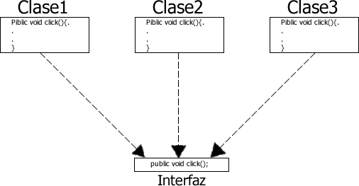
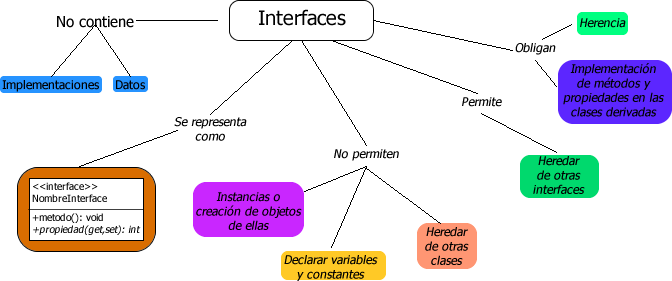
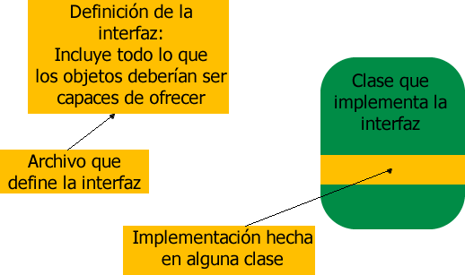
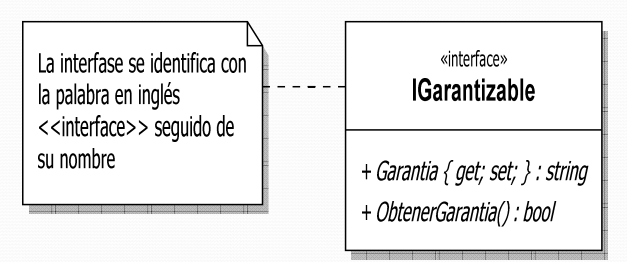
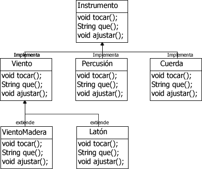
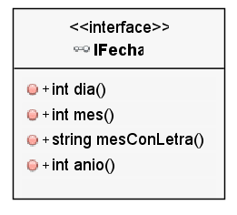
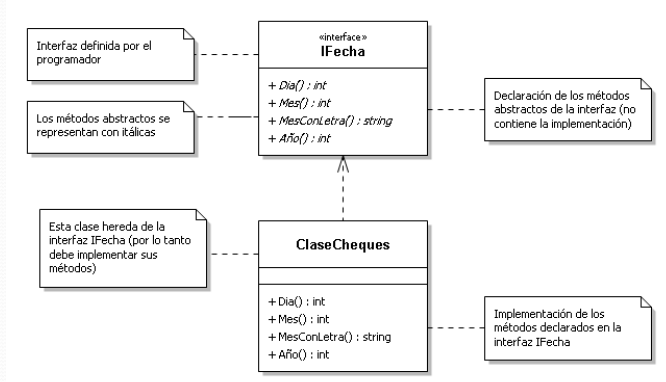

# Programación Orientada a Objetos
## Interfaces

### Dr. Said Polanco Martagón
<!-- page_number: true -->

---

  * Parece paradójico que una clase no pueda crear objetos a partir de ella, ¿realmente lo es?
  * Si una clase abstracta no  puede generar instancias, ¿entonces para qué sirve?
  * Si un miembro abstracto no tiene implementación, ¿entonces para qué sirve?
  * ¿En una clase abstracta, ¿todos los miembros son abstractos?
  * ¿En qué se parece una interface a una clase abstracta?, ¿En qué difieren?
  * ¿Se puede definir un miembro abstracto dentro de una clase no abstracta?

---

  > * Tanto las **clases abstractas** como las **interfaces** son mecanismos que obligan la herencia.


  > * No se pueden instanciar, es decir, no se pueden crear objetos de ellas.

```java
public interface myInterface {
    void myMethod();
    int otherMethod(int count);
}

public static void main(String[] args)
{
    myInterface = new myInterface(); // Esto es un error. ¿de verdad?
}

```
---

## ¿Qué queremos decir con interfaces?

  * NOTA: El término interfaz aquí **NO** se refiere a las interfaces gráficas.
  * Aquí las *interfaces* son una manera de describir que debería hacer una clase sin especificar cómo.
  * Las `interfaces` y `clases` internas son recursos esenciales en el manejo de interfaces gráficas en java.

---
## Definición de interfaz

  * Una interfaz es un conjunto de métodos abstractos y de constantes públicas definidos en un archivo .java.

  * Una interfaz es similar a una clase abstracta llevada al límite, en la que **todos** sus métodos son abstractos.
  
---

La finalidad de la interfaz es la de definir el formato que deben tener determinados métodos que han de implementar ciertas clases.



---

## Interfaces

  * Son mecanismos para que puedan interactuar varios objetos no relacionados entre si.
  * Son protocolos o “contratos” que obligan la herencia.
  * Contienen las declaraciones de los métodos, pero no su implementación. 
  * Al igual que las clases abstractas, son plantillas de comportamiento que deben ser implementados por otras clases.

---



---

## INTERFAZ

  * La palabra clave abstract permite crear uno o más métodos no definidos dentro de una clase: proporcionamos parte de la interfaz, pero sin proporcionar la implementación correspondiente.
  * La implementación se proporciona de las clases que hereden de la clase actual.
  * La palabra clave interface produce una clase completamente abstracta, que no proporciona ninguna implementación en lo absoluto.

---

  * Las interfaces permiten al creador determinar los nombre de lo métodos, las listas de argumentos y los tipos de retorno, pero sin especificar **ningún cuerpo** de **ningún método**.

  * **Una interfaz proporciona simplemente una forma, sin ninguna implementación**.

---

## INTERFAZ
```
  > “Todas las clases que implementen esta interfaz concreta tendrán este aspecto”.
```


---

Sin embargo, una interfaz es algo más que simplemente una clase abstracta llevada al extremo, ya que permite realizar una variante del mecanismo de **“herencia múltiple”**- creando una clase que pueda generalizarse a más de un tipo base.

  * Una interfaz es la descripción de uno o más servicios (métodos) que posteriormente alguna clase puede implementar (y por ende ofrecer).
  * Por ejemplo, si un alumno sabe alemán, tenemos idea de lo que es capaz. Además de ser persona (herencia) él cumple la interfaz, “interprete de alemán). También podría decir que él es un “interprete de alemán” (la misma relación que en herencia).

---

  * Otro ejemplo. Si usted se entera que alguien es salvavidas, él sabrá responder ante una emergencia en el agua. Por una parte está la descripción de qué sabe hacer un salvavidas y por otro hay personas que tienen esas “implementaciones”.
  *  Lo mismo se puede pensar para personas que tienen certificación Java.



---

  * En java cada clase puede tener sólo una clase base (en java no hay herencia múltiple).
  * Cuando hay relación **es-un** con más categorías del mundo real, usamos herencia con una de ellas e interfaces para exhibir un comportamiento como el esperado por las otras.
  * Se cumple también el principio de sustitución.
    * Instancias de la clase que **implementa** una interfaz pueden ser usadas donde se espera una instancia de la interfaz. Es similar a usar una instancia de una subclase cuando se espera un objeto de la clase base.

---

  * No se permite crear instancias (objetos) de una interfaz. Por la misma razón que no se puede crear instancias de clases abstractas, no se tienen implementaciones.
    * `new Interfaz()`
  * Todos los métodos de una interfaz son públicos. No es necesario indicarlo.
  * Pueden incluir constantes. En ese caso son siempre `public static final`.

---

### Ejemplo de una interfaz



```Java
public interface IGarantizable {
  String Garantia;

  String get_garantia();
  void set_garantia(String g);
  bool ObtenerGarantia();
  
}
```

---

## NOTAS SOBRE INTERFACES

  * Una clase que herede de una interface **debe** implementar **TODAS** las definiciones contenidas en ella.

  * Los elementos de la interfaz no llevan los modificadores `public`, `virtual` o `abstract`.

  * **TODOS** los elementos declarados dentro de una interfaz se consideran públicos y abstractos.

---




---

```Java
public interface Instrumento {
  void tocar();
  String que();
  void ajustar();
}


public class Viento implements Instrumento {

  void tocar() { ... };
  void que() { ... };
  void ajustar() { ... };
}

public class VientoMadera extends Viento {
  @Override
  void ajustar()
  {
    super.ajustar();
    System.out.println("De otra forma");
  }
}

```


---

### Ejemplo de una Interfaz diseñada por el programador



  * Obtiene la fecha del sistema mediante `DateTime.Now`
  * Obliga a implementar los métodos que contiene en las clases derivadas de ella.
  * Se deben implementar **todos** sus métodos, de lo contrario nos indica un error.

Los miembros de una interface se considera públicos y virtuales por defecto (no hay necesidad de especificarlo).


---

### Ejemplo de uso IFecha

<!-- TODO: se necesita implementar en java -->



---

### Syntaxis de declaración de una Interfaz.

```
[public] interface Nombre_interfaz {
  tipo metodo1(argumentos);
  tipo metodo2(argumentos);
}
```

```Java
public interface Operaciones {
  void rotar();
  String serializar();
}
```

---

### Más notas sobre interfaces

Al igual que las clases, las interfaces se definen en archivos .java y, como sucede con aquéllas, si la interfaz utiliza el modificar de acceso public, el nombre de la interfaz deberá coincidir con el fichero .java donde se almacena.

Como resultado de la compilación de una interfaz, se genera un archivo .class.

---

  * A la hora de crear una interfaz hay que tener en cuenta las siguientes consideraciones:
    * Todos los métodos definidos en una interfaz son públicos y abstractos.
    * En una interfaz es posible definir constantes, las cuales son publicas y estáticas. Ejemplo:
    > ```
    > int k = 13;
    > public String s = "hj";
    > public static final double p = 4.5;
    > Object o = new Object();
    > ```
    * Una interaz no es una clase.

---

  * Sobre la implementación de interfaces, se ha de tener en cuenta lo siguiente:
    * Cuando una clase implementa una interfaz, está obligada a definir el código (implementar) de todos los métodos existentes en la misma.
    * Una clase puede implementar más de una interfaz.
    > ```Java
    > public class MiClase implements interfaz1, interfaz2, ... {
    > ...
    > }
    > ```

---

  * Una clase puede heredar de otra clase e implementar al mismo tiempo una o varias interfaces.
    * Ejemplo: Si la clase Triangulo quisiera tener los métodos rotar() y serializar(), podría implementar la interfaz Operaciones y seguir heredando la clase Figura.
      > ```Java
      > public class MiClase extends SuperClase implements Interfaz1, Interfaz2 { ... }
      > ```
    Una interfaz puede heredar otras interfaces.
      > ```Java
      > public interface MiInterfaz extends Interaz1, Interfaz2 { ... }
      > ```

---

## INTERFACES Y POLIMORFISMO

Como ya ocurriera con las clases abstractas, el principal objetivo que persiguen las interfaces con la definición de un formato común de métodos es el **polimorfismo**.

Una **variable de tipo interfaz puede almacenar cualquier objeto de las clases que la implementan**, pudiendo utilizar esta variable para invocar a los métodos del objeto que han sido declarados en la interfaz e implementados en la clase

```Java
Operaciones op = new Triangulo();
op.rotar();
op.serializar;
```

---

## Interfaces en JAVA SE

  * Java.lang.Runnable.
  * Java.útil.Enumeration
  * Java.awt.event.WindowsListener
  * Java.sql.Connection
  * Java.Serializable
