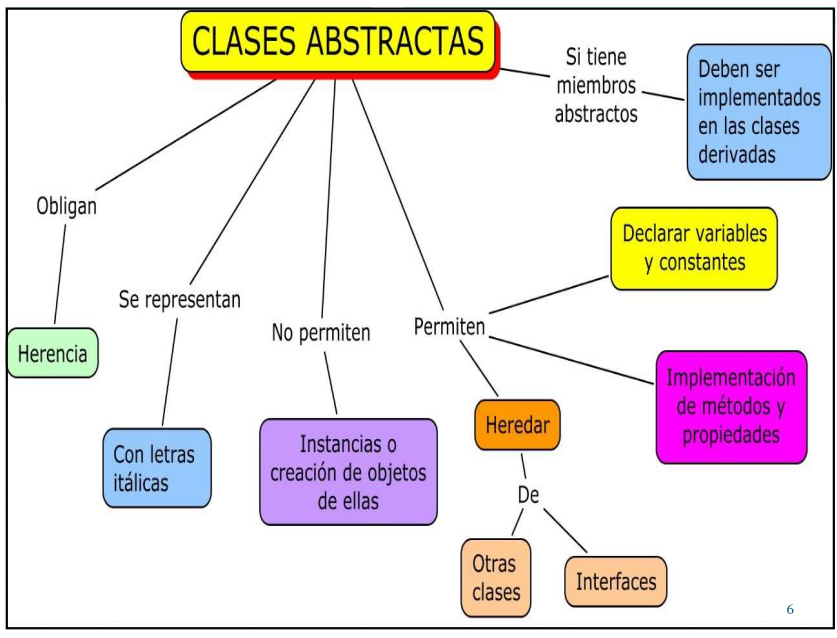
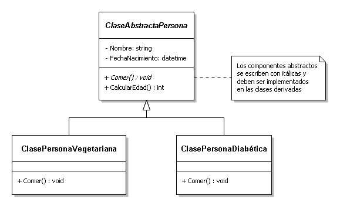
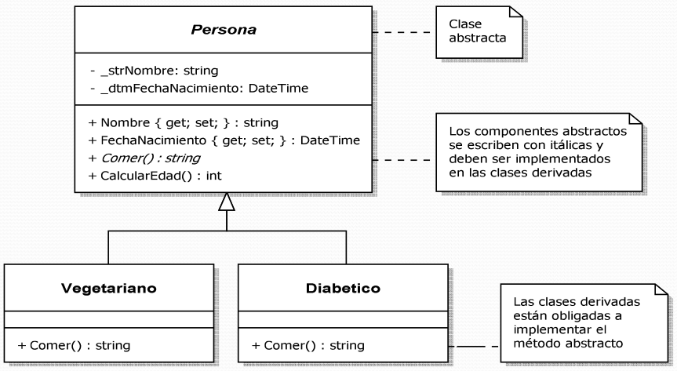
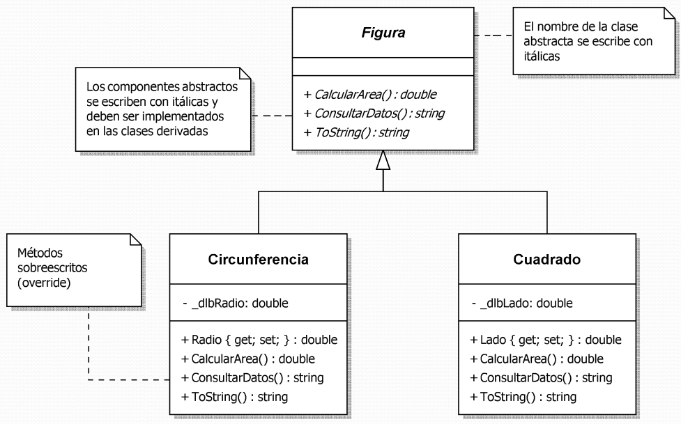
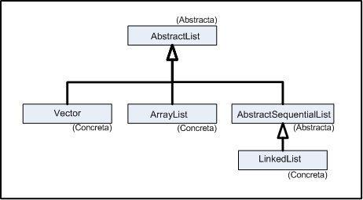

# PROGAMAMACIÓN ORIENTADA A OBJETOS
## CLASES ABSTRACTAS

Dr. Said Polanco Martagón.

---

## Preguntas detonadoas

  * Parece paradójico que una clase no pueda crear objetos a partir de ella, ¿realmente lo es?

  * Si una clase abstracta no puede generar instancias, ¿entonces para qué sirve?

  * Si un miembro abstracto no tiene implementación, ¿entonces para qué sirve?

  * En una clase abstracta, ¿todos sus miembros son abstractos? ¿En qué se parece una interfase a una clase abstracta? ¿En qué difieren?

  * ¿Se puede definir un miembro abstracto dentro de una clase no abstracta?

--- 
## Clases abstractas e interfaces

  * Tanto las clases abstractas como las interfaces son mecanismos que obligan la herencia.

   * No se pueden instanciar, es decir, no se puede crear objetos de ellas.

---

## Clases abstractas

  * Son mecanismos que obligan la herencia.
  * No se pueden instanciar, es decir, no se puede crear objetos de ellas.
  * Se utilizan solamente para heredar de ellas (Forzar u obligar la herencia).
  * Se antepone la palabra `abstract` al nombre de la clase.

---



---

## Ejemplo de clase abstracta



---

## Implementación de una clase abstracta

```Java
public abstract class ClaseAbstractaPersona {
    String Nombre;
    private DateTime FechaNacimiento;
    protected String genero;

    public abstract void comer();

    public  int CalcularEdad()
    {
        ...
    }
}
```

<!-- footer:  Ver código completo en codes/EjemploClaseAbstracta -->

[Codigo_completo](codes/EjemploClaseAbstracta)

---

## Clases abstractas con elementos abstractos

  * Las clases abstractas pueden definir métodos y propiedades abstractos, con lo que su respectiva implementación en la subclase es obligatoria. (Los elementos abstractos DEBEN ser sobreescritos en la subclase).

  * Se utiliza `abstract` para definir elementos abstractos (solo dentro de clases abstractas).

  * Los elementos abstractos NO proporcionan implementación; solo declaraciones.

  * En la subclase, se utiliza “override” para realizar la implementación correspondiente.

---

## Miembros abstractos

  * Una clase abstracta puede tener datos (atributos) e implementar métodos y propiedades como una clase normal y además puede tener miembros abstractos (métodos o propiedades).

  * Los miembros abstractos NO tienen implementación *(están vacíos)*.

  * ¿Para qué sirve un método vacío o propiedad vacía y que no realiza acciones?



<!-- footer: En UML las clases y sus miembros abstractos se escriben con itálicas y en Java se codifican anteponiendo la palabra abstract -->

---

## Clase abstracta con método abstractos



[código_completo](codes/EjemploSimpleCasesAbstractas)

---

## Clases abstractas en la API de Java.

Java utiliza clases abstractas en el API de la misma forma que podemos nosotros usarlas en nuestros programas. Por ejemplo, la clase bstractList del paquete java.util es una clase abstracta con tres subclases:



---

Como vemos, entre las subclases dos de ellas son concretas mientras que una todavía es abstracta. En una clase como `AbstractList` algunos métodos son abstractos, lo que obliga a que el método esté sobrescrito en las subclases, mientras que otros métodos no son abstractos. Sobre un objeto de una subclase, llamar a un método puede dar lugar a:

  1. La ejecución del método **tal y como esté definido en la subclase**.
  1. La búsqueda del método **ascendiendo por las superclases** hasta que se encuentra y puede ser ejecutado. Es lo que ocurrirá por ejemplo con `toString()` si no está difinido en la subclase.