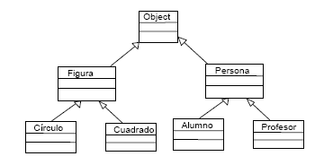
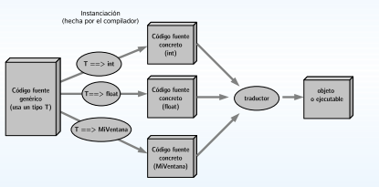

# Progamación Orientada a Objetos
## Introducción a la genericidad
### Dr. Said P. Martagón

---

## Clases fundamentales

Todas lcas clases de java poseen una superclase común, esa es la clase `Object`. Por eso los métodos de la clase `Object` son fundamentales, ya que todas las clases los heredan.

Esos métodos están pensados para todas las clases, pero hay que definirlos para que funcionen adecuadamente.

Es decir, `Object proporciona métodos que son heredados por todas las clases. La idea es que todas las clases utilicen el mismo nombre y prototípo de método para hacer operaciones comunes como **comprobr igualdad, clonar, etc**, y para ello habrá que definir esos métodos a fin de que se ajusten adecuadamente a cada clase.

---

## Comparar Objetos.

La clase `Object`proporciona un método para comprobar si dos objetos son iguales. Este método es `equals`. Este método recibe como parámetro un objeto con quien comparar y devuelve true si los dos objetos son iguales.

No es lo mismo equals que usar la comparación de igualdad. Ejemplos:

```Java
Coche uno = new cohce("Renault", "Megane", "P4324K");
Coche dos=uno;
boolean resultado=(uno.equals(dos)); // Resultado valdrá true
resultado = (uno==dos); // Resultado también valdrá true
dos = new new cohce("Renault", "Megane", "P4324K");
resultado = (uno.equals(dos)); // resultado valdrá true
resultado = (uno == dos); // Resultado ahora valdrá false
```

---

El operador `==` devuelve true si los dos objetos se refieren a la misma cosa (las dos referencias apuntan al mismo objeto). 

Realmente en el ejemplo anterior la respuesta del método equals sólo será válida si en la clase que se está comparando (Coche en el ejemplo) se ha redefinido el método equals. Esto no es opcional sino obligatorio si se quiere usar este método. El resultado de equals depende de cuándo consideremos nosotros que devolver verdadero o falso.

---

La clase Object define una serie de métodos que pueden utilizarse sobre todos los objetos que se creen en Java. Estos métodos son: `clone(), equals(), finalize(), getClass(), hashCode(), toString(), wait(), notify() y notifyAll()`.

El método `toString()` devuelve una cadena asociada al objeto. De esta forma todos los objetos en Java tienen una representación en forma de cadena de texto.

El método `hashCode()` devuelve un entero que puede utilizarse como identificador único del objeto en la máquina virtual.

---

## La madre de todas las clases `Object`

En Java todas las clases descienden de la clase Object.



Es como si el compilador añadiera **“extends Object”** a todas las clases que no extienden explícitamente a ninguna otra.

---

## Introducción: Genericidad

La programación orientada a objetos tiene como principales objetivos favorecer **la confiabilidad, reusabilidad y extensibilidad** del software.

Adoptar el enfoque propuesto por la programación orientada a objetos implica:
  * En la etapa de diseño reducir la complejidad en base a la descomposición del problema en piezas más simples a partir de la identificación de objetos y su organización en una estructura de clases.
  * En la etapa de implementación utilizar un lenguaje que permita retener la estructura de clases identificada en la etapa de diseño y encapsular la representación interna de modo que sea inaccesible desde el exterior.

---

### Genericidad

El **encapsulamiento** permite usar una clase considerando qué funcionalidad brinda, sin tener en cuenta cómo la implementa.

La **herencia** permite aumentar el nivel de abstracción mediante un proceso de clasificación en niveles.

El proceso consiste en abstraer lo que es común y esencial en un conjunto de entidades para formar un concepto general que comprenda a todas.

Una clase derivada puede pensarse como una **especialización** de una clase más general.

Alternativamente podemos pensar a una clase derivada como una **extensión** de la clase base.

---

La extensibilidad se refiere a reducir el impacto de los cambios. 

Las modificaciones con frecuencia pueden resolverse definiendo nuevas clases específicas, sin necesidad de cambiar las que ya han sido verificadas.

La reusabilidad evita escribir el mismo código repetidamente. Para lograrlo es necesario distinguir el comportamiento general del particular.

La genericidad favorece la reusabilidad.

**Una clase *genérica* encapsula a una estructura cuyo comportamiento es independiente del tipo de las componentes.**

La genericidad puede modelarse en Java de dos maneras diferentes: usando **tipos de datos parametrizados** o usando **herencia**.

---

La genericidad es un mecanismo que permite:
  * Escribir trozos de código genérico (subprogramas, clases, interfaces, packages), que incluye referencias a uno o variosnombres de tipos de datos o clases sin que exista una declaración de los mismos (se denominan parámetros de tipo).
  * Particularizar el código anterior, indicando los tipos concretos existentes en los que se convierten los parámetros de tipos, y generando código concreto (todo esto hecho por el compilador en tiempo de compilación).
  * Especificar restricciones para los paámetros de tipo del código genérico.

---

## Esquema de la genericidad



---

### Ventajas de la genericidad

Simplicidad y legibilidad: permite agrupar comportamiento común y reducir el tamaño de los programas.

Fiabilidad: detección temprana de errores en el proceso de desarrollo.

Eficiencia: permite al compilador, en tiempo de compilación, generar código eficiente en tiempo y memoria adaptando a cada instanciación correcta del template.

---

La genericidad se usa para agrupar comportamiento común y evitar código distinto pero con aspectos comunes.

  * La herencia y el polimorfismo de herencia permiten lo mismo.
  * Los mecanismos anteriores son mecanismos básicamente resueltos en tiempo de ejecución.
  * La genericidad es un mecanismo en tiempo de compilación.
  * La herencia permite agrupar comportamiento mediante la extensión de tipos,  luego debe preveerse en el diseño de una clase.
  * La genericidad permite lo mismo sin mediar la extensión de tipos, luego impone menos condiciones al código y puede usarse para una clase después de ser diseñada.
  * En algunos lenguajes, la herencia y el polimorfismo de herencia suponen un coste en tiempo y memoria mayor que el que supone la genericidad.

---

## Ejemplo de genericidad en Java

La genericidad fue agregada en java 5 para prover chequeo en tiempo de compilación y eliminar el riesgo de excepciones de casteo (ClassCastException) muy común cuando se trabajaba con colecciones. El framework de colecciones fue totalemente renovado utilizando clases genéricas. Veamos cómo la genericidad nos ayuda en las colecciones.

```Java
List list = new ArrayList();
list.add("abc");
list.add(new Integer(5)); // OK

for (object obj: list) {
    String str = (String) obj; // type casting leading to ClassCastException at runtime
}
```

---

Después de java 5, podemos utilizar las clases colección de la siguiente manera:

```Java
List<String> list1 = new ArrayList<String>(); // Java 7 ? List<String> list1 = new ArrayList<>();
list1.add("abc");
//list1.add(new Integer(5)); // compile error

for (String str : list1) {
    // no type casting needed, avoids ClassCastException
}
```

---

## Genericidad en clases e Interfaces

Podemos definir nuestras propias clases e interfaces con tipos genéricos. Un tipo genérico es una clase o interfaz que parametrizada sobre tipos. Se utilizan los paréntesis angulares (<>) para especificar el parámetro de tipo.

```Java
public class GenericTypeOld {
    private Object t;

    public Object get() {
        return t;
    }

    public void set(Object t) {
        this.t = t;
    }

    public static void main(String args[]) {
        GenericTypeOld type = new GenericTypeOld();
        type.set("Pankaj");
        // type casting, error prone and can cause ClassCastException
        String str = (String) type.get(); 
    }
}
```

---

Notamos que cuando utilizamos esta clase, tenemos que utilizar un casteo de tipo, lo que produce una ClassCastException en tiempo de ejecución. Escribimos las misma clase pero como genérica.
```Java
public class GenericsType<T> {
  private T L;

  public T get() {
    return this.t;
  }

  public void set(T t1) {
    this.t = t1;
  }

  public static void main(String args[]) {
    GenericsType<String> type = new GenericsType<>();
    type.set("Pankaj"); // Valid

    GenericsType type1 = new GenericsType(); // rawType
    type1.set("Pankaj"); // valid
    type1.set(10); // valid and autoboxing support
  }
}
```

---

La interfaz comparable es un buen ejemplo de una interfaz genérica.
```Java
package java.lang;
import java.util.*;

public interface Comparable<T> {
  int compareTo(T o);
}
```

De una forma similar, podemos utilizar la genericidad en nuestras clases e interfaces. También podemos tener multiples parámetros “tipo” cómo en la interfaz Map.

---

## Estándar de nombre en tipos genéricos

La estandarización nos ayuda a entender código más fácilmente y el nombramiento de tipos es una buena práctica en java. Los parámetros más utilizados son:

  * E – Elemento (usado extensamente por los colecciones de java, por ejemplo ArrayList, Set, etc).
  * K – Key (utilizado en map).
  * N – Número
  * T – Tipo.
  * V – Valor (Utilizado en map).
  * S,U,V, etc. 2do, 3er, 4to tipo.

---

## Invocando e instanciando un tipo genérico

Para referenciar la clase genérica box, se tiene que realizar una invocación de tipo genérico, Donde T es reemplazado con algún tipo concreto, como un Integer.
```Java
public class Box<T> {
  // T stands for "Type"
  private T t;
  public void set(T t) { this.t = t; }
  public T get() { return t; }
}
```

Una invocación de un tipo genérico es generalmente conocido como un tipo parametrizado.

```Java
Box<Integer> integerBox;
```
---

En java SE7 y posterior, se pueden reemplazar los argumentos requeridos para invocar el constructor de una clase genérica como un conjunto vacío (<>), de este modo el compilador lo puede determinar o inferir a partir del contexto.

```Java
Box<Integer> integerBox = new Box<>();
```

---

Una clase genérica puede tener múltiples parámetros. Por ejemplo

```Java
public interface Pair<K, V> {
  public K getKey();
  public V getValue();
}

public class OrderedPair<K, V> implements Pair<K, V> {
  private K key;
  private V value;

  public OrderedPair(K key, V value) {
    this.key = key;
    this.value = value;
  }

  public K getKey() { return key; }
  public V getValue() { return value; }
}
```

---

Las siguientes sentencias crean dos instancias de la clase ParOrdenado:

```Java
Pair<String, Integer> p1 = new OrderedPair<String, Integer>("Even", 8);
Pair<String, String> p2 = new OrderedPair<String, String>("hello", "world");
```

---

## Tipos parametrizados

También se puede substituir una parámetro de tipo (es decir, k o v) por un tipo parametrizado (por ejemplo, `List<String>`). Por ejemplo.

```Java
OrderedPair<String, Box<Integer>> p = new OrderedPair<>("primes", new Box<Integer>(...));
```

---

### Tipos Vacios

Un tipo vacío es el  nombre de una clase o interface sin ningún tipo de argumentos.
```Java
public class Box<T> {
  public void set(T t) { /* ... */}
  // ...
}

Box rawBox = newBox/(;)
```

Básicamente se utiliza un tipo `object` como parámetro, con las desventajas dichas anteriormente.

---

## Métodos vacios

*Métodos genéricos* son métodos que introducen sus propios parámetros tipo. Es similar a la declaración de tipos genéricos, pero el alcance esta limitado al método donde fue declarado. Métodos estáticos y no estáticos son permitidos, así como constructores de clase.

```Java
public class Pair<K, V> {
  private K key;
  private V value;

  public Pair(K key, V value) {
    this.key = key;
    this.value = value;
  }

  public void setKey(K key) { this.key = key; }
  public void setValue(V value) { this.value = value; }
  public K getKey { return key; }
  public V getValue() { return value; }
}

public class Util {
  public static <K, V> boolean compare (Pair<K, V> p1, Pair<K, V> p2) {
    return p1.getKey().equals(p2.getKey()) && p1.getValue().equals(p2.getValue());
  }
}
```

---

Sintaxis de Invocación:
```Java
Pair<Integer, String> p1 = new Pair<>(1, "appe");
Pair<Integer, String> p2 = new Pair<>(2, "pear");
boolean same = Util.<Integer, String>compare(p1, p2);
```

Sintaxis sin explicitación
```Java
Pair<Integer, String> p1 = new Pair<>(1, "apple");
Pair<Integer, String> p2 = new Pair<>(2, "pear");
boolean same = Util.compare(p1, p2);
```

---

## Paŕametros acotados

Existen ocasiones donde se desea restringir los tipos que pueden ser utilizados como argumentos en tipos parametrizados. Por ejemplo, una método que opere con números sólo puede aceptar instancias de Números o sus subclases. Para esto sirve los parámetros acotados.

Para declarar parámetros acotados, liste el nombre del parámetro, seguido por la instrucción `extends`, seguidor de su cota superior, por ejemplo Number. Note que, en este contexto, `extends` es utilizado en sentido general para significar “se extiende” (como en las clases) o “implementa” (como en las interfaces).

```Java
public class Box<T> {
  private T t;

  public void set(T t) {
    this.t = t;
  }

  public T get() {
    return t;
  }

  public <U extends Number> void inpect(U u) {
    System.out.println("T: " + t.getclass().getName());
    System.out.println("U :" + u.getClass().getName());
  }

  public static void main(String[ args]) {
    Box<Integer> integerBox = new Box<Integer>();
    integer.Box.set(new Integer(10));
    integerBox.inspect("some text"); // Error: this is still string
  }
}
```

---

Modificando nuestro método genérico para incluir tipos acotados, **la compilación ahora falla**, dado que nuestra invocación de inspect aún incluye un String.

```
Box.java:21: <U>inspect(U) in Box<java.lang.Integer> cannot be applied to (java.lang.String)...
error
```

Adicionalmente para limitar los tipos se puede usar instancias de un tipo genérico. Los parámetros acotados permiten invocar métodos definidos en los límites

---

El método `isEven` invoca al método `intValue` definido en la clase `Integer` por medio de n.

```Java
public class NaturalNumber<T extends Integer> {
  private T n;
  public NaturalNumber(T t) { this.n = n; }
  public boolean isEven() {
    return n.intValue() % 2 == 0;
  }

  // ...
}
```