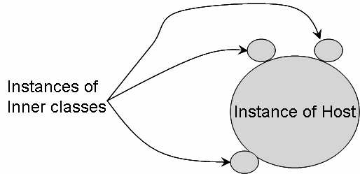

# Objetct Oriented Programming
## Conflicting Interfaces
### Dr. Said Polanco Martagón

---

Interfaces provide extensibility in an object-oriented system. They allow us to switch implementations, and help us decouple from our dependencies. When we go though a system evolution or though an evolutionary design, what happens if we run into two interfaces with same method signature, but different semantics?. We will look at the problems and then the solution in Java.

---

## Interfaces

Interfaces represent pure abstractness in object modeling. In C++, we may write them as pure abstract classes–classes with only pure virtual methods. In Java and .NET, we use the interface keyword to write them–we’re not allowed to place any fields or implement any methods in these interfaces.

An example of an interface in Java is shown below:

```Java
public interface Pianist
{
    public String getName();
    public void play();
}
```

---

The `Pianist` interface has a method to get the name and a method to ask the pianist to play. You may have different classes to implement it. You may create a Mock object that implements this interface for testing purpose. You may have a `Person` class that implements this interface. You may have a `Robot` class implement this, and so on, depending on your application.

---

# Implementing the interface

Let's create a `Mock` object to implement the `Pianist` interface and see how it works. Here is a simple example that uses this interface.

```Java
public class MockPianist implements Pianist {
    public String getName()
    {
        return "Mock Pianist";
    }

    public void play()
    {
        System.out.println("Mock playing piano");
    }
}
```

---

```Java
public class MyTestCase
{
    public static void usePianist(Pianist p)
    {
        System.out.println("Using Pianist");
        System.out.println("Name: " + p.getName());
        p.play();
    }

    public static void main(String[] args)
    {
        MockPianist aMockPianist = new MockPianist();
        usePianist(aMockPianist);
    }
}
```

---

The `MockPianist` provides a simple implementation of the `Pianist` interface. The `main()` method of the `MyTestCase` class is creating an object of the `MockPianist` and is using its `Pianist` interface. The output from this example is shown below:

```
Using Pianist
Name: Mock Pianist
Mock playing piano
```

---

## Another Interface and Mock

Assume as we go along with the evolution of an application, we see a need for another interface, say, `Athlete` . Let’s write the interface and create a Mock and a test code for that as well as shown below:

```Java
public interface Athlete
{
    public String getName();
    public void play();
}

public class MockAthlete implements Athlete
{
    public String getName()
    {
        return "Mock Athlete";
    }
    public void play()
    {
        System.out.println("Mock Athlete playing");
    }
}

public class MyTestCase
{
    public static void usePianist(Pianist p)
    {
        System.out.println("Using Pianist");
        System.out.println("Name: " + p.getName());
        p.play();
    }
    public static void useAthlete(Athlete a)
    {
        System.out.println("Using Athlete");
        System.out.println("Name: " + a.getName());
        a.play();
    }
    public static void main(String[] args)
    {
        MockPianist aMockPianist = new MockPianist();
        usePianist(aMockPianist);
        MockAthlete aMockAthlete = new MockAthlete();
        useAthlete(aMockAthlete);
    }
}
```
---

The `Athlete` interface has a `getName()` method and a `play()` method. You may argue that the method names should not be the same as in the `Pianist` interface. But, the athlete and pianist may be pretty independent at this point in the evolution of your system. Furthermore, what if the `Athlete` interface is actually given to you from a third party library you just decided to use. Then you can’t argue that the methods in that interface should not collide with any interface already in your system.

---

## A Person Pianist
Let’s implement a class Person which implements the Pianist interface as shown below:

```Java
public class Person implements Pianist
{
    public String getName()
    {
        return "Joe";
    }
    public void play()
    {
        System.out.println("Joe playing Piano");
    }
}
```

---

The code to exercise this class is show here:

```Java
public static void main(String[] args)
{
    MockPianist aMockPianist = new MockPianist();
    usePianist(aMockPianist);
    MockAthlete aMockAthlete = new MockAthlete();
    useAthlete(aMockAthlete);
    Person aPerson = new Person();
    usePianist(aPerson);
}
```
---

We are creating an object of `Person` and exercising its `Pianist` interface in this test. The output from this program is shown below:
```
Using Pianist
Name: Mock Pianist
Mock playing piano
Using Athlete
Name: Mock Athlete
Mock Athlete playing
Using Pianist
Name: Joe
Joe playing Piano
```

---

## Colliding Interfaces

Now what if we want this person to be a pianist and an athlete? How can we ask the person to sprint? If the `Person` class implements the `Athlete` interface, the `getName()` method is just fine as it returns the name of the person. However, what do you do about the `play()` method? You want the person to sprint if called using an Athlete interface, and play the piano if called using the Pianist interface. In Java, you can’t have two implementations of the `play()` method with same signature in the `Person` class–you’ll get a compilation error.

---

## Solution

No, don’t throw in the towel. There is a solution in Java–inner classes can get us around.

*Inner classes* in Java are classes written within another class. These differ from the nested class concept in C++ in that an inner class has full access to its host class, including private members. There are four types of inner classes in Java: inner class, local inner class, anonymous inner class and static inner class. Except for the static inner class, the instances of all the other three types of inner classes have an implicit reference to an instance of their host class. That is, every object of these inner classes (except static inner class) is always attached to an instance of its host class. In this regard, I call these inner classes as *parasites*. The figure below illustrates this:

---



Let’s see how we can use an inner class to get around the problem of colliding interfaces.
In the `Person` class you first write a method `playAthlete()` as shown below:
```Java
public void playAthlete()
{
    System.out.println("Joe sprints");
}
```

---

Then, you write an inner class called PersonAsAthlete which uses the methods of `Person` class to implement the Athlete interface as shown below:

```Java
public class Person implements Pianist
{
    // ... methods getName(), play() and playAthlete()
    // are not shown here.
    private class PersonAsAthlete implements Athlete
    {
        public String getName()
        {
            return Person.this.getName();
        }
        public void play()
        {
            Person.this.playAthlete();
        }
    }
}
```

---
In the `getName()` method of the `PersonAsAthlete` inner class, we invoke the `getName()` method of the `Person` class using this weird `Person. ` notation. In Java, you generally use a class name to access to a static member. In the case of inner classes, you use the class name to gain access to the instance of the host class. Similarly, in the `play()` method of the `PersonAsAthlete` inner class, you are using the `playAthlete()` method of the host class.

---

You have made the `PersonAsAthlete` class private. So, how can any one use it? Let’s provide a method in the Person class to help with that as shown here:

```Java
public class Person implements Pianist
{
    // ...
    public Athlete getAthlete()
    {
        return new PersonAsAthlete();
    }
}
```

---

Now, let’s complete the test code to use this:

```Java
public static void main(String[] args)
{
    MockPianist aMockPianist = new MockPianist();usePianist(aMockPianist);
    MockAthlete aMockAthlete = new MockAthlete();
    useAthlete(aMockAthlete);
    Person aPerson = new Person();
    usePianist(aPerson);
    useAthlete(Aperson.getAthlete());
}
```

---

Running the program gives us the following output now:

```
Using Pianist
Name: Mock Pianist
Mock playing piano
Using Athlete
Name: Mock Athlete
Mock Athlete playing
Using Pianist
Name: Joe
Joe playing Piano
Using Athlete
Name: Joe
Joe sprints
```

---

# Conclusion

If two or more interfaces have the same method signature, but different semantics, we end up with colliding interfaces. This may not be avoidable when using third party components or libraries. In Java, you may use inner classes to work around this problem.